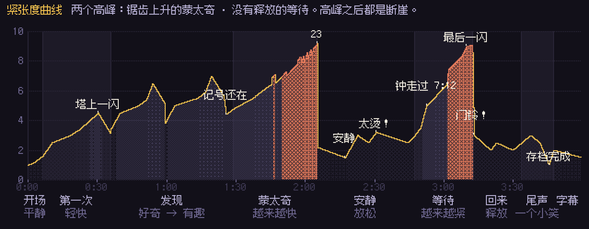

# 《存档点》 前期 · 节拍表 / 紧张度曲线 / 镜头表（草稿）

> 检查点 1。这里的时长是草稿，动态分镜阶段会跟着音乐的小节线和表演再调整。
> 全片目标约 **3:48**（正片 3:30 + 片尾字幕 18 秒）。片名短片头单独做，不算在内。

## 0. 几个先定下来的规则

| 规则 | 画面上怎么体现 |
|---|---|
| **读档** | 画面褪成 4 色（像掌机屏幕），一切倒着走：抹布倒着擦、光斑倒着移、钟倒着转、门倒着关。右下角出现存档图标。 |
| **只有店主记得** | 柜台底下的粉笔记号。读档后所有东西复原，只有记号还在。记号插入镜头每次都从同一个机位拍，数量一眼能比。 |
| **勇者的进门是"脚本"** | 勇者从开门到拍下 50 金币，每一轮都是同一段动画、同一帧，连门铃、脚步声都一样。店主的反应每一轮都不同。 |
| **店主是 NPC** | 照脚本做事时，他的动作是游戏精灵那样的 2～4 帧循环（每秒 4～6 张，没有中间帧）。从"发现"开始，他的动作慢慢出现中间帧；第一次走出柜台时，变成每秒 12 张、有预备和跟随的真正表演。**帧率本身就在讲故事。** |
| **边界** | 柜台左端的活板门处有一道看不见的"碰撞格子"。撞上时，8×8 的格子线闪一下；最后一次，格子像像素一样碎开、掉落、消失。 |
| **时间** | 墙上的钟每一轮都从 7:00 走到 7:12 就被倒回去。"等待"一段里，分针第一次走过 7:12。 |
| **界面** | 勇者进门时左上角出现他的 HUD（头像、红心、金币数）；柜台前弹出商店菜单（只有图标和数字）；右下角是存档图标。菜单是 NPC 的"嘴"，也是规则的一部分：价签能改，菜单里的价格改不了。 |

## 1. 节拍表

时间是草稿，`张力` 是 0–10 的紧张度（见第 2 节）。

### ① 开场 · 平静 （0:00–0:14）
| 时间 | 节拍 | 张力 | 声音 |
|---|---|---|---|
| 0:00 | 黑场。右下角一个小小的存档图标在转。 | 1 | 安静；存档图标转动时一个很轻的机械"滴答"。 |
| 0:03 | 道具店像游戏读地图一样，一行一行（8 像素一行）铺出来，从天花板的梁到地板。 | 1.5 | 每铺一行一声很轻的"嗒"，音高沿主题的第一句往上走。 |
| 0:08 | 地图铺完，清晨的光斜着照进来，灰尘在光里飘。店主在柜台后面机械地循环擦柜台（2 帧循环）。钟：7:00。窗外远山顶上是魔王塔。 | 1.5 | 地图铺完的那一拍，商店 BGM 从头开始（像游戏一样）。 |

### ② 第一次 · 轻快 （0:14–0:38）
| 时间 | 节拍 | 张力 | 声音 |
|---|---|---|---|
| 0:14 | **门铃。**勇者一跳进门，站定，叉腰，鼻孔朝天。左上角弹出他的 HUD：3 颗心、50 金币。 | 2.5 | 门铃（音高在调上）。BGM 不停。 |
| 0:17 | 蹦蹦跳跳走到柜台前，**"啪"**地把 50 金币全拍在柜台上。 | 3 | 金币落桌，落在强拍上。 |
| 0:20 | 商店菜单弹出：木剑 50 / 盾 80 / 药水 20。光标跳到木剑。店主（NPC 两帧动作）递出木剑，金币数 50→0。 | 3 | 菜单"嘀"声在调上。 |
| 0:24 | 勇者举剑摆英雄姿势，剑尖一闪。 | 3.5 | 一小句"获得道具"的乐句，在 BGM 里面，不另起。 |
| 0:26 | 转身出门，门铃。 | 3 | |
| 0:27 | **窗外插入：**勇者沿山路往塔走，越走越小。 | 3 | 屋里的 BGM 隔着窗变远一点。 |
| 0:31 | 塔顶一闪，远远一声闷响。几拍后，窗外飘进一小段"游戏结束"的音乐（远、闷、在调上）。 | 4.5 | BGM 在闷响前半拍停住。游戏结束的乐句是主题开头倒过来、放慢。 |
| 0:35 | **读档：**画面褪成 4 色，一切倒着走。 | 3.5 | 倒带声，BGM 倒放一小段。 |

### ③ 发现 · 好奇，然后变有趣 （0:38–1:12）
| 时间 | 节拍 | 张力 | 声音 |
|---|---|---|---|
| 0:38 | 门铃。勇者一模一样地进门。店主擦柜台的手停在半空——**第一次，他的循环断了。**头顶冒出 **!?** | 4.5 | BGM 从头开始，一模一样。门铃一模一样。 |
| 0:41 | 店主看看窗外，看看勇者，再看看窗外。勇者照样拍下金币，店主慢半拍才递剑（第一次出现中间帧）。 | 5 | |
| 0:47 | 勇者摆同一个姿势，出门。店主探身看门口。窗外：一样的路、一样的一闪。 | 5 | "游戏结束"又来了，一模一样。 |
| 0:53 | 读档。 | 4 | |
| 0:55 | **插入·柜台底下：**店主蹲下，用粉笔在柜台背板上画下一道记号。 | 4 | 粉笔"吱"的一声。安静的一拍。 |
| 0:58 | 门铃。店主抢在勇者拍金币之前，**指墙上的盾**（价签 80）。勇者看盾，摸钱袋，HUD 上的 50 闪一下，摇头，照样买木剑。 | 5 | |
| 1:05 | 出门，一闪，"游戏结束"。读档。 | 5.5 | |
| 1:08 | **插入·柜台底下（同一机位）：**抹布、木剑、光斑都复原了，**只有那道记号还在。**店主盯着它看了一会儿，在旁边画上第二道。 | 5 | 这一拍几乎没有声音。然后粉笔"吱"。 |

### ④ 蒙太奇 · 越来越快（第一个高潮） （1:12–1:50）
每一轮都比上一轮短；窗外每次死法都不一样；店主的反应一轮比一轮不同。

| 时间 | 节拍 | 张力 | 声音 |
|---|---|---|---|
| 1:12 | **改价签：**店主偷偷把盾的价签从 80 改成 50（插入：粉笔把 8 描成 5）。勇者看见 50，眼睛发亮——菜单弹出来：盾 **80**。价签能改，菜单改不了。勇者看看价签又看看菜单（?），耸肩，买木剑。 | 6 | 蒙太奇的音乐从这里开始：同一首主题，一段连续的音乐，越来越快。 |
| 1:20 | 窗外：**一团火光**。 | 6 | |
| 1:22 | **塞药水：**店主把药水塞进木剑的包装里。勇者走到门口发现了，一脸正直地走回来，把药水端端正正放回柜台，敬个礼，出门。 | 6.5 | |
| 1:28 | 窗外：**从悬崖掉下去的小点。** | 6.5 | |
| 1:29 | 插入·记号：5 → 9。 | 7 | |
| 1:31 | **收据背面画地图：**勇者拿着地图认真点头——拿倒了。 | 7 | |
| 1:35 | 窗外：**被史莱姆弹飞**（一个小点划出一道弧）。 | 7.5 | |
| 1:36 | **想走出柜台：**店主从活板门往外走，"咚"地撞上看不见的墙，碰撞格子闪一下，被弹回来。 | 7.5 | 一声弹簧"嘣"，在调上。 |
| 1:39 | 插入·记号：14。 | 8 | |
| 1:40 | 越来越短的轮次（每轮 1–2 秒）：店主抱着胳膊跺脚；店主趴在柜台上；店主面无表情地提前把木剑递到半空；店主跟着勇者一起摆英雄姿势（动作都背下来了）。窗外：闪、弹、掉、闪…… | 8.5 | 读档变成每小节一次的"嗖"。 |
| 1:48 | 插入·记号：23。店主的粉笔停住。 | 9 | 高潮不靠"大"：乐队不加人，只是越来越快、越来越短，然后在一个小节线上突然停。 |

### ⑤ 安静 · 放松 （1:50–2:26）
| 时间 | 节拍 | 张力 | 声音 |
|---|---|---|---|
| 1:50 | 读档。门铃。勇者进门——**没有走向柜台**。他在门边的长凳上坐下，剑靠在腿上，累了。 | 2 | **没有 BGM。**只有屋里的声音：钟、窗外的风、烛火……这是全片第一次真正的安静。 |
| 1:57 | 店主看着他。很久。 | 1.5 | |
| 2:01 | 店主放下抹布，走到活板门。停一下。往前一步——碰撞格子亮起来，然后**像像素一样碎开**，一格一格掉下来，消失。**他第一次走出柜台。**（从这里起，他的动作是每秒 12 张的真正表演。） | 3 | 碎开时一串很轻的、在调上的像素音。然后一件乐器轻轻进来（主题，很慢）。 |
| 2:08 | 他拿起小炉子上的茶壶，倒一杯茶，双手端着走过去，递给勇者。 | 2.5 | 倒茶声（真实录音）。 |
| 2:15 | 勇者一口喝下——**太烫**，吐舌头，扇风。店主眉毛一挑。 | 3 | 一个小小的拨弦笑点，在调上。 |
| 2:19 | 店主把盾、药水、一张画着魔王弱点的收据放在他身边。勇者要掏钱，店主把他的手按回去，摇头。 | 2.5 | 主题第一句，完整地、轻轻地。 |

### ⑥ 等待 · 越来越紧（第二个高潮） （2:26–2:58）
| 时间 | 节拍 | 张力 | 声音 |
|---|---|---|---|
| 2:26 | 勇者背上盾，走出门。店主回到柜台后面。 | 3.5 | 钟的滴答成了节拍。 |
| 2:30 | **插入·钟：**分针走到 7:12——停了一拍——**走过去了。** | 5 | 本该倒带的那一拍，什么也没发生。 |
| 2:34 | 光斑慢慢移过地板，窗外变成黄昏，然后是夜。店主点上一支蜡烛。 | 6 | 一个持续的低音，和声悬着不解决。 |
| 2:42 | 窗外：塔上一闪一闪……（战斗）。**没有"游戏结束"的音乐。** | 7.5 | 每次闪光，一个很轻的低音拨弦；等着熟悉的那句"游戏结束"——没来。 |
| 2:48 | 插入·蜡烛：蜡烛短了一截。店主的手交叉放在柜台上，一动不动（呼吸还在）。 | 8 | |
| 2:52 | 夜最深的时候，塔上最后一闪。然后什么也没有。 | 9 | 只剩钟和烛火。 |

### ⑦ 回来 · 释放 （2:58–3:18）
| 时间 | 节拍 | 张力 | 声音 |
|---|---|---|---|
| 2:58 | 窗外泛白。**门铃。**勇者浑身是伤、绷带、缺口的盾，扛着魔王的角进门，"咚"地放在柜台上。 | 3 | 门铃的音高正好是悬了一整段的那个和弦的解决音。 |
| 3:04 | **插入·店主头像特写：**一个很小的笑（嘴角动一个像素，眼睛眯一点）。 | 2 | 主题终于完整地走到它的终止式——这是全片第一次，这首曲子没有被打断。 |
| 3:08 | 勇者挥挥手，出门去下一段冒险。 | 2.5 | |
| 3:11 | 店主把角挂上墙。 | 2 | |
| 3:14 | **插入·柜台底下：**在那排记号的最后，画了一颗星。 | 2 | |

### ⑧ 尾声 · 一个小笑 （3:18–3:30）
| 时间 | 节拍 | 张力 | 声音 |
|---|---|---|---|
| 3:18 | 门铃。一个新勇者（换了配色和发型）攥着 50 金币进来，眼睛盯着木剑。 | 3 | BGM 从第一小节重新开始（笑点）。 |
| 3:23 | 店主头也不抬，把盾、药水和收据一起推过柜台。 | 2.5 | |
| 3:27 | 切黑。存档图标转一下，变成一个勾：存档完成。 | 1 | 存档完成的三个音。 |

### ⑨ 片尾字幕 （3:30–3:48）
像素风字幕。旁边是勇者各种死法的"花絮"小画面（火光、悬崖、史莱姆、还有正片里没出现的几种）。只写本片相关的内容。主题完整演奏一遍。

## 2. 紧张度曲线

数据在 `src/film/beats.js`，全片的画面节奏、剪辑、配乐的密度和音量都从这一条曲线读。几个设计：

- **两个高峰形状不同。**蒙太奇（1:48）是锯齿形往上爬：每一轮都有一个小落差（读档），但落差越来越小、越来越密。等待（2:52）是平滑的斜坡：没有任何释放，一直往上。
- **高峰之后都是断崖。**1:50 直接从 9 掉到 2（安静），2:58 从 9 掉到 3（门铃）。
- **"温情 3–5 秒内用笑点收住"：**2:08 倒茶（2.5）→ 2:15 太烫（3）；3:04 微笑（2）→ 3:08 挥手出门；3:14 星星 → 3:18 新勇者。
- **"喜剧里留一拍安静"：**0:55 粉笔之前、1:08 记号还在、1:48 粉笔停住、1:50 坐下。
- **响度跟曲线走，但有上限：**最响的地方（蒙太奇末尾）比开场只响约 4 LU，靠密度和速度而不是音量。

## 3. 镜头表（草稿）

`W` = 固定全景（像游戏画面，320×180 全屏，机位永远不动）。其他都是插入镜头，用同样大小的像素**重新画**，不是放大。

| # | 时间 | 镜头 | 内容 |
|---|---|---|---|
| 01 | 0:00 | 黑场 | 存档图标在转 |
| 02 | 0:03 | W · 读地图 | 一行一行铺出道具店 |
| 03 | 0:08 | W | 清晨，灰尘，NPC 擦柜台 |
| 04 | 0:14 | W | 第一轮：进门 → 拍金币 → 菜单 → 英雄姿势 → 出门 |
| 05 | 0:27 | 窗 | 窗框里的远景：山路、塔、一闪 |
| 06 | 0:35 | W · 读档 | 4 色倒带 |
| 07 | 0:38 | W | 第二轮：!?、看窗、慢半拍 |
| 08 | 0:49 | 窗 | 同样的一闪（和 05 同一段画面） |
| 09 | 0:53 | W · 读档 | |
| 10 | 0:55 | 柜台底下 | 第一道记号 |
| 11 | 0:58 | W | 第三轮：指盾，摇头 |
| 12 | 1:05 | 窗 → W · 读档 | |
| 13 | 1:08 | 柜台底下 | 记号还在，第二道 |
| 14 | 1:12 | W | 改价签（W 里完成，菜单在画面上弹出） |
| 15 | 1:14 | 价签特写 | 8 → 5（1.5 秒） |
| 16 | 1:20 | 窗 | 火光 |
| 17 | 1:22 | W | 塞药水、还药水 |
| 18 | 1:28 | 窗 | 掉下悬崖 |
| 19 | 1:29 | 柜台底下 | 5 → 9 |
| 20 | 1:31 | W | 地图拿倒了 |
| 21 | 1:35 | 窗 | 史莱姆弹飞 |
| 22 | 1:36 | W | 撞上碰撞格子 |
| 23 | 1:39 | 柜台底下 | 14 |
| 24–29 | 1:40 | W / 窗交替 | 越来越短的轮次（6 个镜头，从 2 秒缩到 0.7 秒） |
| 30 | 1:48 | 柜台底下 | 23，粉笔停住 |
| 31 | 1:50 | W（长镜头，约 18 秒） | 坐下 → 安静 → 走出柜台 → 边界碎开 → 倒茶 |
| 32 | 2:12 | 中景 · 长凳 | 递茶、握杯、太烫、吐舌头（人物用 2 倍细节重画） |
| 33 | 2:19 | W | 盾、药水、收据；按回钱袋 |
| 34 | 2:26 | W | 出门，回柜台 |
| 35 | 2:30 | 钟 | 分针走过 7:12 |
| 36 | 2:34 | W（时间流逝） | 光斑移动，黄昏，夜，点蜡烛 |
| 37 | 2:42 | 窗 · 夜 | 塔上的闪光 |
| 38 | 2:48 | 蜡烛 | 短了一截，交叉的手 |
| 39 | 2:50 | W · 夜 | 最后一闪，什么也没有 |
| 40 | 2:58 | W · 黎明 | 门铃，带着角回来，"咚" |
| 41 | 3:04 | 头像特写 | 很小的笑 |
| 42 | 3:08 | W | 挥手出门，把角挂上墙 |
| 43 | 3:14 | 柜台底下 | 一颗星 |
| 44 | 3:18 | W | 新勇者；把三样东西推过去 |
| 45 | 3:27 | 黑场 | 存档完成 |
| 46 | 3:30 | 字幕 | 像素字幕 + 死法花絮 |

约 46 个镜头，其中一半在蒙太奇里（那一段本来就该快）。其他段落以 W 为主，⑤ 安静一段用一个约 18 秒的长镜头。

**固定全景 W 的布局（草稿，设计阶段按选定方案细化）：**后墙左边是门（门框里能看到外面的街），门右边靠墙一条长凳；后墙中间是窗（窗里能看到村子、远山、山顶的魔王塔，勇者走的山路就在窗里）；右边是柜台和后面的货架，柜台左端是活板门（边界就在这里）；墙上挂着盾（带价签）、钟。地板占画面下面约 1/4，人物可以前后站位。前景不挡任何关键动作。

## 4. 配乐的结构（草稿，第 3 步做小样）

一首"商店 BGM"贯穿全片，像游戏一样循环；它的完整曲式是 A A′ B A″ + 终止式，但**直到 ⑦ 回来之前，它从来没能完整地走到终止式**——每一轮都在半路被"游戏结束"打断、被读档倒回第一小节。

| 段落 | 音乐 |
|---|---|
| ① ② ③ | 商店 BGM（小编制：拨弦、竖琴、木琴、长笛、手鼓，16 位游戏的采样音色）。每一轮读档后从第一小节重新开始——"又重来了"是听得出来的。 |
| 窗外的"游戏结束" | 主题的开头倒过来、放慢，远远地、闷闷地从窗外飘进来。每次死亡都一样（直到 ⑥ 它不再出现）。 |
| ④ 蒙太奇 | 一整段连续的音乐，不停：同一个主题，同一个编制，越来越快；读档变成落在小节线上的"嗖"，每一轮的长度 8 小节 → 4 → 2 → 1。最后在一个小节线上干脆地停。 |
| ⑤ 安静 | 先是完全没有音乐。边界碎开之后，一件乐器（八音盒/竖琴）很慢地弹主题。 |
| ⑥ 等待 | 钟的滴答就是节拍；一个持续低音，和声悬着；塔上每次闪光一个很轻的低音。一直在等"游戏结束"那一句——它没来。 |
| ⑦ 回来 | 门铃的音高解决了悬着的和弦。主题第一次完整走到终止式。编制不加大。 |
| ⑧ 尾声 | BGM 从第一小节重新开始；切黑时停在一个存档完成的三个音上。 |
| ⑨ 字幕 | 主题完整演奏一遍（整首曲子唯一一次不被打断地从头到尾）。 |

所有有音高的音效（门铃、金币、菜单、存档、像素碎开）都在主题的调上。

## 5. 技术路线（沿用上一部的"画面是时间的函数"）

- **原生分辨率 320×180。**1080p 正好放大 6 倍，720p 正好 4 倍，两个交付版本都是整数倍、最近邻放大，像素边缘不会糊。
- **一条故事时间表**（`src/film/beats.js` 起步）驱动画面、界面、音效时间点和配乐的小节线。
- **画面全部在 Node 里逐帧计算**，写进一张"索引色 G-buffer"（每个像素存"哪条色阶、第几级"），光照和时间只改色阶级数、换调色板，所以光影永远是像素画式的色块和有序抖动，不会出现半透明渐变。
- **人物**是一套 3D 骨架 + 一组软形状（胶囊、椭球，关节处平滑融合），在原生像素网格上逐像素求交，再做像素画的色阶、选择性描边和清理。整个人物每一帧是一个整体，轮廓连续，关节不会露缝；转身、前后伸手都有正确的透视；特写用同样的像素大小、更高的细节级别重新计算，不是放大。脸（眼睛、嘴、眉毛、眼镜）用手绘的像素图章按表情和朝向贴上去。
- 编码：先在原生分辨率渲染，再用 ffmpeg 最近邻整数倍放大，x264 `-tune animation`、4:4:4 母版 + 4:2:0 交付版（色度按 2×2 对齐像素网格，颜色不串）。
